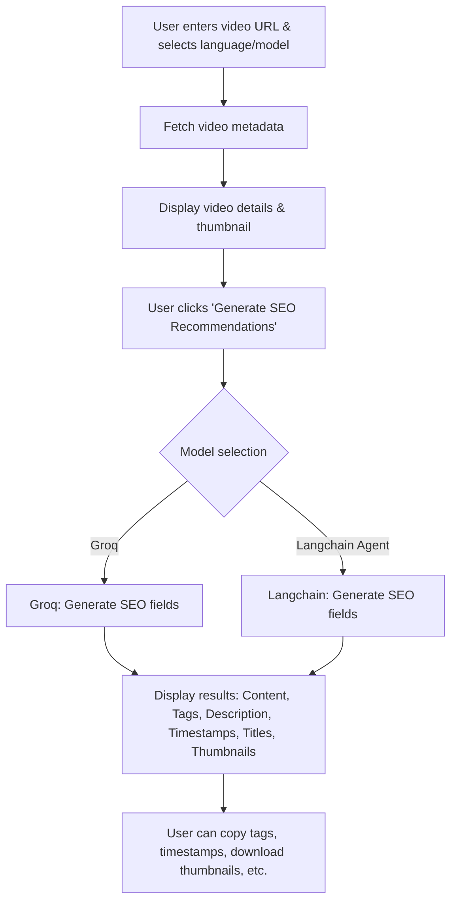

# Video SEO Optimizer Pro

**Multilingual, Platform-Specific Video SEO Recommendations with AI**

---

## 🚀 Features

- Analyze YouTube and other video URLs for SEO optimization
- Supports multiple languages (English, Spanish, French, German, Italian, Portuguese, Japanese, Korean, Chinese, Russian, Arabic)
- Generates:
  - 35 trending tags
  - SEO-optimized description
  - Strategic timestamps
  - 5+ SEO-friendly titles
  - Platform-optimized thumbnails
- Modern Streamlit UI

---

## 🛠️ How It Works



---

## 🖥️ Getting Started

1. **Clone the repository:**
   ```bash
   git clone https://github.com/yourusername/your-repo-name.git
   cd your-repo-name
   ```

2. **Install dependencies:**
   ```bash
   pip install -r requirements.txt
   ```

3. **Set up API keys:**
   - Add your `GROQ_API_KEY` and (optionally) `STABILITY_API_KEY` in a `.env` file or via the Streamlit sidebar.

4. **Run the app:**
   ```bash
   streamlit run app.py
   ```

---

## 📝 How to Add a Project Description to the Repo

1. **Edit the README.md file** (this file) to update the project description at the top.
2. **On GitHub:**  
   - Go to your repository page.
   - Click the gear/settings icon next to the repo name.
   - In the “Description” field, add a short summary (e.g., “AI-powered multilingual video SEO optimizer for YouTube and more”).
   - Click “Save”.

---

## 📄 Template for Project Description

> **AI-powered multilingual video SEO optimizer for YouTube and other platforms. Generates tags, descriptions, timestamps, titles, and thumbnails using Groq and Langchain. Modern Streamlit UI.**

---

## 🤝 Contributing

1. Fork the repo
2. Create your feature branch (`git checkout -b feature/YourFeature`)
3. Commit your changes (`git commit -am 'Add new feature'`)
4. Push to the branch (`git push origin feature/YourFeature`)
5. Open a Pull Request

---

## 📧 Contact

For questions or support, open an issue or contact the maintainer.

